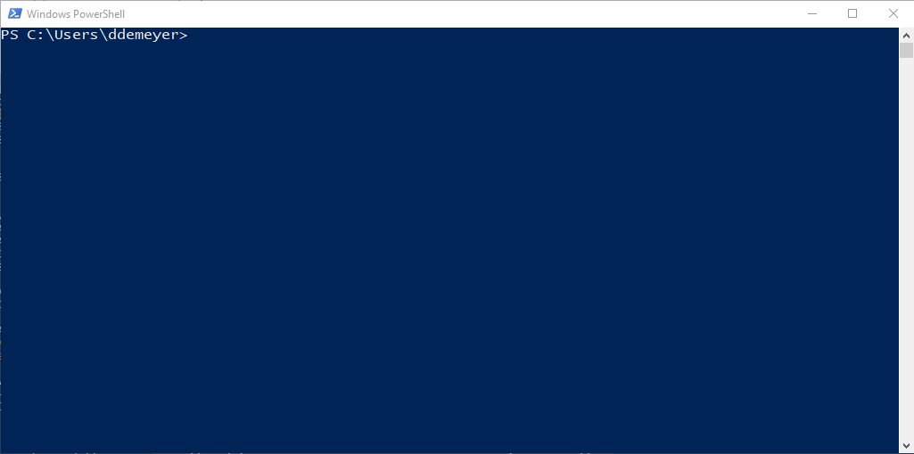

# Installation of ISHRemote

This guide probably works for various ISHRemote versions - however only verified on installing ISHRemote v8.0 on Windows 10 :) Remember that ISHRemote v7.0 was the first module version to run cross platform on PowerShell 7.0+ - earlier versions of ISHRemote are Windows PowerShell only.

Below you'll find the handy links to prerequisites, install/upgrade statements, and our best practices across the available PowerShell platforms. Start by selecting your PowerShell host, and then our suggested scenario to get your environment set up.

# PowerShell 7.4+
Latest stable branch of cross platform PowerShell powered by .NET 8.0. 

These days preferably installed over the Windows Packet Manager, see [installing-powershell](https://learn.microsoft.com/en-us/powershell/scripting/install/installing-powershell-on-windows) or the [macOS](https://learn.microsoft.com/en-us/powershell/scripting/install/installing-powershell-on-macos)/[linux](https://learn.microsoft.com/en-us/powershell/scripting/install/installing-powershell-on-linux) sibling links.

```cmd
winget install --id Microsoft.Powershell --source winget
```

This version of PowerShell comes with a different PowerShell module installer `PSResourceGet` ([src](https://devblogs.microsoft.com/powershell/psresourceget-is-generally-available/)), so using statements like `Install-PSResource` instead of deprecated `Install-Module`. Below the statements for initial module installation, upgrade or even prerelease version.

```powershell
# QUERY
Get-InstalledPSResource
Find-Module ISHRemote -Repository PSGallery 
Find-Module ISHRemote -Repository PSGallery -AllowPrerelease

# INSTALL LATEST RELEASED
Install-PSResource -Name ISHRemote -Repository PSGallery -Scope CurrentUser

# INSTALL PRERELEASE
Install-PSResource -Name ISHRemote -Repository PSGallery -Scope CurrentUser -Prerelease

# UPDATE EXISTING MODULES
Get-InstalledPSResource | Out-GridView -PassThru | Update-PSResource 
Get-InstalledPSResource | Out-GridView -PassThru | Update-PSResource -Prerelease
# The -PassThru allows you to multiselect several packages

# UNINSTALL
Uninstall-PSResource -Name ISHRemote
```

# PowerShell 7.0-7.3
Earlier branch of cross platform PowerShell powered by .NET 6.0. We advise you to switch to PowerShell 7.4+ section regarding Microsoft platform support. 

Regarding cmdlets to use, see Windows PowerShell 5.1 section.

# Windows PowerShell 5.1
Latest Windows-only platform powered by Windows .NET Framework 4.8.1. If your code does not have Windows integration needs (like Active Directory, or ISHDeploy) then the advice is to switch to PowerShell 7.4+ runtime and in turn section. Below the statements for initial module installation, upgrade or even prerelease version based on deprecated module `PowerShellGet`.



```powershell
# PREREQUISITE per PowerShell session as PSGallery switched to HTTPS over Tls12 and higher
[Net.ServicePointManager]::SecurityProtocol = [Net.SecurityProtocolType]::Tls12

# QUERY
Get-InstalledModule
Find-Module -Name ISHRemote -Repository PSGallery

# INSTALL LATEST RELEASED
Install-Module -Name ISHRemote -Repository PSGallery -Scope CurrentUser -Force 

# INSTALL PRERELEASE (requires PowerShellGet 2.2.5, see lower)
Install-Module -Name ISHRemote -Repository PSGallery -Scope CurrentUser -AllowPrerelease

# UPDATE EXISTING MODULES
Get-InstalledModule | Out-GridView -PassThru | Update-Module
# The -PassThru allows you to multiselect several packages
# Update-Module can be extended with parameter -AllowPrerelease but do note that you then can update from proper release to preview releases

# UNINSTALL
Uninstall-Module ISHRemote -AllVersion 
```

Note the TLS 1.2 clause. An indication that services like powershellgallery.com raised the bar on security but that runtimes like .NET Framework 4.8.1 cannot change their defaults. Hence an explicit statement to allow a secure connection.

## Windows PowerShell 5.1 on PowerShellGet 2.2.5+ or latest PSResourceGet

If you want to align both Windows PowerShell 5.1 and PowerShell 7.4+ to `PSResourceGet`, or have `PowerShellGet` upgraded to latest; have a look below:
```powershell
# Switching from 'PowerShellGet' to 'PSResourceGet'
Get-InstalledModule 
# Should show PowerShellGet of version 2.2.5 or up 
# Also PackageManagement package should be something like 1.4.8.1 or up
# Otherwise execute Windows PowerShell As Administrator:
Install-Module PowershellGet -Force
# Switch from deprecated PowerShellGet 2.2.5 to PowerShell 7.4+ PSResourceGet module installer: 
Install-Module -Name Microsoft.PowerShell.PSResourceGet
```

# Other interesting modules

* Microsoft.PowerShell.SecretManagement
* Microsoft.PowerShell.SecretStore
* Pester
* ImportExcel
