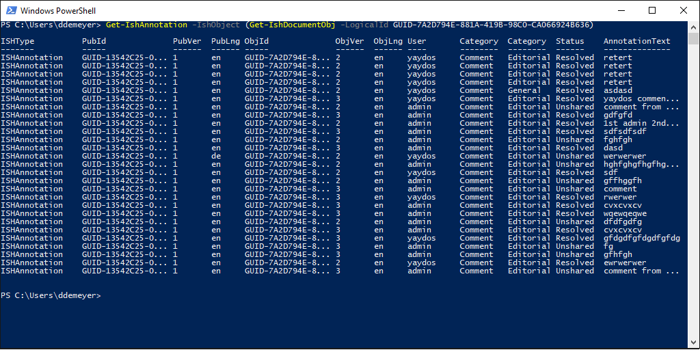
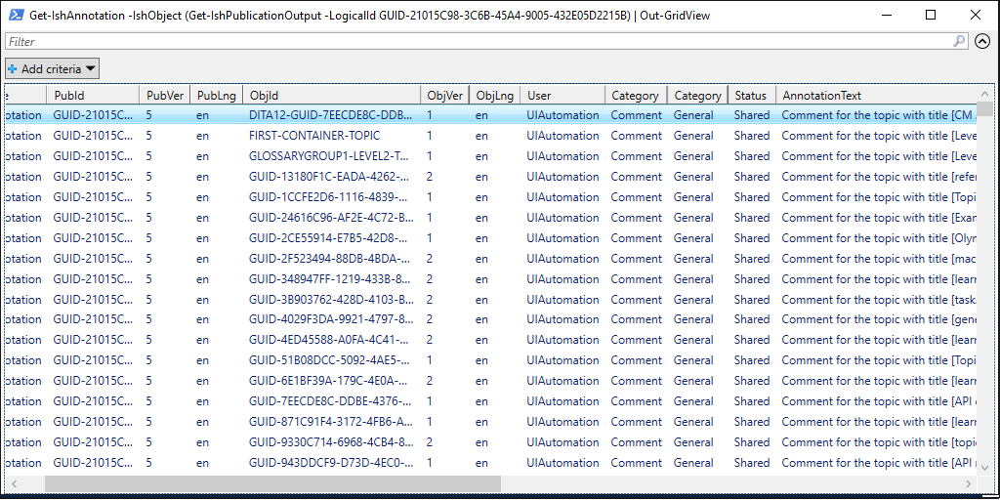
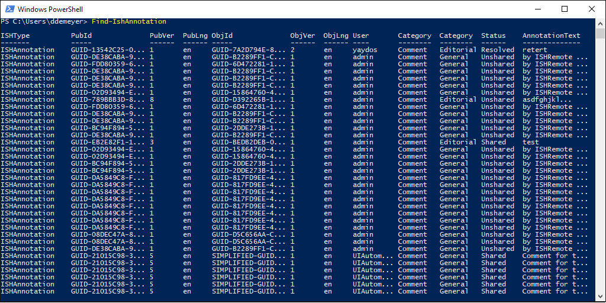

# Release Notes of ISHRemote v0.11

Actual detailed release notes are on [Github](https://github.com/rws/ISHRemote/releases/tag/v0.11), below some code samples.

Remember
* All C# source code of the ISHRemote library is online at [Source](https://github.com/rws/ISHRemote/tree/master/Source/ISHRemote/Trisoft.ISHRemote), including handling of WS-Trust protocol ([InfoShareWcfConnection.cs](https://github.com/rws/ISHRemote/blob/master/Source/ISHRemote/Trisoft.ISHRemote/InfoShareWcfConnection.cs)).
* All PowerShell-based Pester integration tests are located per cmdlet complying with the `*.tests.ps1` file naming convention. See for example [AddIshDocumentObj.Tests.ps1](https://github.com/rws/ISHRemote/blob/master/Source/ISHRemote/Trisoft.ISHRemote/Cmdlets/DocumentObj/AddIshDocumentObj.Tests.ps1) or [TestIshValidXml.Tests.ps1](https://github.com/rws/ISHRemote/blob/master/Source/ISHRemote/Trisoft.ISHRemote/Cmdlets/FileProcessor/TestIshValidXml.Tests.ps1)

## Annotation Handling

Annotations (commonly known as Comments) in Collective Spaces (so Draft Space and Review Space).

### Sample - Custom Reports per Content Object

```powershell
New-IshSession -WsBaseUrl https://example.com/ISHWS/ -PSCredential Admin
Get-IshAnnotation -IshObject (Get-IshDocumentObj -LogicalId GUID-7A2D794E-881A-419B-98C0-CA066924B636)
```



### Sample - Custom Reports per Publication

```powershell
New-IshSession -WsBaseUrl https://example.com/ISHWS/ -PSCredential Admin
Get-IshAnnotation -IshObject (Get-IshPublicationOutput -LogicalId GUID-21015C98-3C6B-45A4-9005-432E05D2215B) |
Out-GridView
```




### Sample - Custom Reports

```powershell
New-IshSession -WsBaseUrl https://example.com/ISHWS/ -PSCredential Admin
Find-IshAnnotation
```
results in 



### Sample - Corrective Actions

The example retrieves all Annotations related to the specified publication GUID. In turn it is passed over the pipeline to the gridview with option `-PassThru`, the latter option enables selecting one-or-more annotation to pass to the next cmdlet on the pipeline: `Remove-IshAnnotation`.
The remove could be replaced by a `Set-IshAnnotation` that alter annotations, shares them (make public), etc

```powershell
New-IshSession -WsBaseUrl https://example.com/ISHWS/ -PSCredential Admin
Get-IshAnnotation -IshObject (Get-IshPublicationOutput -LogicalId GUID-21015C98-3C6B-45A4-9005-432E05D2215B) |
Out-GridView -PassThru |
Remove-IshAnnotation
```

