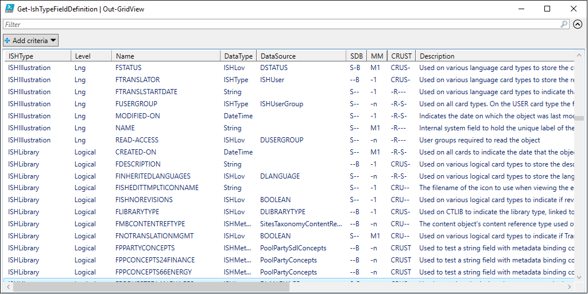

# Release Notes of ISHRemote v0.13

Actual detailed release notes are on [Github](https://github.com/sdl/ISHRemote/releases/tag/v0.13), below some code samples.

Remember
* All C# source code of the ISHRemote library is online at [Source](https://github.com/sdl/ISHRemote/tree/master/Source/ISHRemote/Trisoft.ISHRemote), including handling of WS-Trust protocol ([InfoShareWcfConnection.cs](https://github.com/sdl/ISHRemote/blob/master/Source/ISHRemote/Trisoft.ISHRemote/InfoShareWcfConnection.cs)).
* All PowerShell-based Pester integration tests are located per cmdlet complying with the `*.tests.ps1` file naming convention. See for example [AddIshDocumentObj.Tests.ps1](https://github.com/sdl/ISHRemote/blob/master/Source/ISHRemote/Trisoft.ISHRemote/Cmdlets/DocumentObj/AddIshDocumentObj.Tests.ps1) or [TestIshValidXml.Tests.ps1](https://github.com/sdl/ISHRemote/blob/master/Source/ISHRemote/Trisoft.ISHRemote/Cmdlets/FileProcessor/TestIshValidXml.Tests.ps1)

## Type and Field Setup

Existing cmdlet `Get-IshTypeFieldDefinition` was extended to show `IMetadataBinding` (i.e. `IHandler`) and `IMetadataBindingAndTagging` instances setup on your repository. So what recently changed
- `CRUS` became `CRUST` where the last `T` indicate if the field is smart-taggable.
- `DataSource` column shows for ListOfValues the Domain that controls the permitted values. You can find them by for example `Get-IshLovValue -LovId DSTATUS`
- `DataSource` column shows for card types the type the system links to like ISHUser for user fields.
- `DataSource` column shows for string fields which MetadataBinding source is controlling the taxonomy of `SitesTaxonomyContentReferenceType`

```powershell
New-IshSession -WsBaseUrl https://example.com/ISHWS/ -PSCredential Admin
Get-IshTypeFieldDefinition | Out-GridView
```
results in 



Breakdown of the image is
- ISHType is the card type. Nice to know is that ISHModule are topics, ISHMasterDoc are maps and ISHTemplate are other objects.
- Level is the card level
- Field Name, so now you have fields set up with types
- DataTypes are the basic types (String, DateTime, Number), ListOfValues, Types and ISHMetadataBinding... it indicates what the data type is and what the controls are on it like permitted values
- DataSource (see higher)
- SDB is short for System (used by the CMS), Descriptive (identifying fields, reasonably readable by users) and Basic fields (what users expect to see in UIs)
- MM where the first M is Mandatory or not. Next M is multi-value where 1 is single value and n is multi-value
- CRUST is short for Create, Read, Update, Search (available for Full Text Search) and Taggable (IMetadataBindingAndTagging enabled)
- Description is a low level description on how the field is typically used or linked.


## Repository Corrections

### Problem Statement

The main problem is that repositories can be small regarding amount of folders and content objects or can become very big after years of usage. Initially people will use `Find-IshDocumentObj` or `Find-IshPublicationOutput` to filter and retrieve the content objects you are interested to process further. However, as described in [#49](https://github.com/sdl/ISHRemote/issues/49), you potentially are pulling your full database to the memory of your PowerShell process.

### Sample - Trigger Smart Tags across folder and subfolders

The alternative is to navigate your data set in smaller chunks, then folders comes to mind. So the below script, authenticates you by creating an IshSession. A breakdown...
1. This IshSession is implicitly passed to `Get-IshFolder` which starts on folder `General\Myfolder` and recursively returns folders of the mentioned type (i.e. Topics, Maps and Library Topics) to the pipeline.
1. The pipeline IshFolder objects are passed to `Get-IshFolderContent` to retrieve the content objects that match the filter criteria (i.e. latest version per logical object, and in turn only English language object).
1. The pipeline IshObject (so content objects) are passed to `Add-IshBackgroundTask` that triggers the `SMARTTAG` BackgroundTask handler event. Note this event has to be configured in Settings > 'Xml BackgroundTask Settings' and it can also be tweaked to update less fields with auto-suggested Concepts.
1. The pipeline IshBackgroundTask objects are stored in a variable where you can later on track the asynchronous progress over `Get-IshBackgroundTask`.

```powershell
New-IshSession -WsBaseUrl https://example.com/ISHWS/ -PSCredential Admin
$ishBackgroundTask = Get-IshFolder -FolderPath "General\Myfolder" -FolderTypeFilter @("ISHModule", "ISHMasterDoc", "ISHLibrary") -Recurse |
                     Get-IshFolderContent -VersionFilter Latest -LanguagesFilter en |
                     Add-IshBackgroundTask -EventType "SMARTTAG"
```

### Sample - Custom actions across folder and subfolders

The alternative is to navigate your data set in smaller chunks, then folders comes to mind. So the below script, authenticates you by creating an IshSession. A breakdown...
1. Setting up my filter criteria to be used later on content objects.
1. Base folder `Data` is in practice "General", the repository root folder. Parameter `-FolderTypeFilter` is explicitly set for all content objects, implicitly skipping ISHPublication. Ommitting `-FolderTypeFilter` in practice means no filtering on object type.
1. The pipeline IshFolder objects are passed to `Foreach-Object {...}` (short hand `%{...}`) to create a script block for custom actions.
    1. The pipeline IshFolder object in the script block is available as `$PSItem` (short hand `$_`). Initially to print a folder name.
    1. The pipeline IshFolder object is passed to retrieve its folder content, specifically all languages on the latest (highest) version.
    1. Returned IshObjects can be further handled like `Set-IshDocumentObj` or write to file, or `Get-IshDocumentObjData` to retrieve the actual files.
1. Optionally in this sample, the pipeline IshObjects are passed to `Out-GridView` for visual representation. Notice the `-PassThru` which allows even further selection in that grid view, after pressing OK the selection is passed to the pipeline again.

```powershell
New-IshSession -WsBaseUrl https://example.com/ISHWS/ -PSCredential Admin
$metadataFilter = Set-IshMetadataFilterField -Level Lng -Name CHECKED-OUT-BY -FilterOperator In -Value ("Admin, Admin2")
$ishObjects = Get-IshFolder -BaseFolder Data -FolderTypeFilter @("ISHModule", "ISHMasterDoc", "ISHLibrary", "ISHIllustration", "ISHTemplate")  -Recurse | 
Foreach-Object {
    Write-Host ("Handling folder[$($PSItem.name)]...")
    $ishObjects = Get-IshFolderContent -IshFolder $PSItem -VersionFilter Latest -MetadataFilter $metadataFilter
    # Create some report, some extra checks, a transformation, etc
    Write-Output $ishObjects
} |
Out-GridView -PassThru
```

### Sample - Convert-ISHCustomDocumentObj

More examples are in [Sample.Automate.LegacyCorrection.ps1](https://github.com/sdl/ISHRemote/blob/master/Source/ISHRemote/Trisoft.ISHRemote/Samples/Sample.Automate.LegacyCorrection.ps1)

