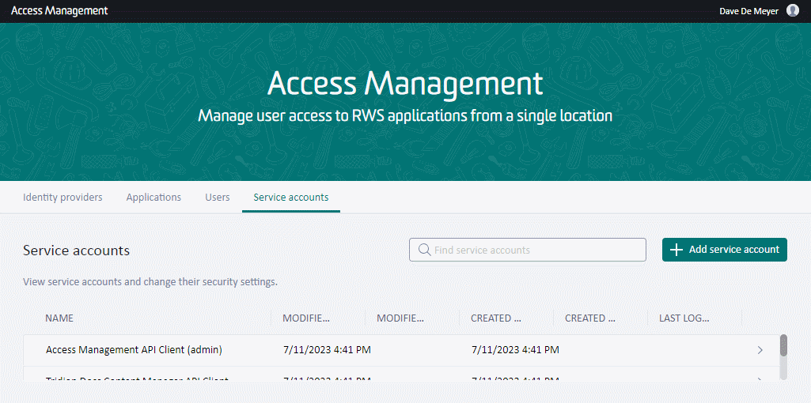
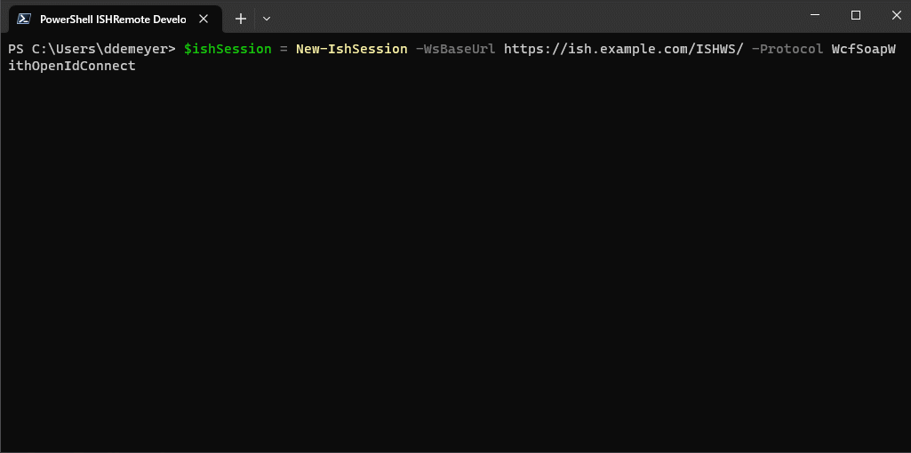

# Release Notes of ISHRemote v8.0

High level release notes are on [Github](https://github.com/rws/ISHRemote/releases/tag/v8.0), below the most detailed release notes we have :)

## General

This release inherits the v0.1 to v0.14 up to v7.0 development branch and features. Most cmdlets and business logic are fully compatible even around authentication (`New-IshSession` and `Test-IshSession` ). In short, we expect it all to work still :)

### Remember
* All C# source code of the ISHRemote library is online at [master](https://github.com/rws/ISHRemote/tree/master/Source/ISHRemote/Trisoft.ISHRemote), including handling of the different [Connection](https://github.com/rws/ISHRemote/tree/master/Source/ISHRemote/Trisoft.ISHRemote/Connection) protocols in a NET 4.8 and NET 6.0+ style.
* All PowerShell-based Pester integration tests are located per cmdlet complying with the `*.tests.ps1` file naming convention. See for example [AddIshDocumentObj.Tests.ps1](https://github.com/rws/ISHRemote/tree/master/Source/ISHRemote/Trisoft.ISHRemote/Cmdlets/DocumentObj/AddIshDocumentObj.Tests.ps1) or [TestIshValidXml.Tests.ps1](https://github.com/rws/ISHRemote/tree/master/Source/ISHRemote/Trisoft.ISHRemote/Cmdlets/FileProcessor/TestIshValidXml.Tests.ps1)

The below text describes the delta compared to fielded release ISHRemote v7.0.

## Introducing Session Protocol

Where we used to have only implicit `WcfSoapWithWsTrust` protocol - same as ISHRemote v7.0 and earlier on Tridion Docs 14SPx/14.0.x and earlier - resulting SOAP Proxy classes on `IShSession`. We now introduce `WcfSoapWithOpenIdConnect` for usage on Tridion Docs 15.x/15.x.0 which results in SOAP Proxy classes that are authenticated over `Modern Authentication`.

* If protocol on a `New-IShSession` cmdlet is forced to `WcfSoapWithWsTrust`, then it behaves the same as ISHRemote v7.0 and earlier or any Tridion Docs 14SPx/14.0.x and earlier system
    * WS-Federation/WS-Trust over –IshUserName/-IshPassword parameters, typical ISHSTS setups
    * WS-Federation/WS-Trust over implicit ActiveDirectory NetworkCredentials , typical ADFS setups
* If protocol is not mentioned, it defaults to `WcfSoapWithOpenIdConnect` on Tridion Docs 15.x/15.x.0
    * Modern Authentication like Publication Manager or Organize Space, etc over your favorite Browser
    * Modern Authentication over –ClientId/-ClientSecret coming from Access Management (ISHAM)
    * Note: ISHWS/OWCF web services have feature parity to ISHWS/WCF (and actually also ISHWS/*.ASMX) 
* If protocol is forced to `OpenApiWithOpenIdConnect`
    * You mostly get fully operational WcfSoapWithOpenIdConnect 
    * You also get an OpenAPI 3.0 experimental proxy on your IShSession object (the future)

### OpenIdConnect Client Credentials Flow

On Tridion Docs 15.x/15.x.0 the below cmdlet with superfluous `-Protocol WcfSoapWithOpenIdConnect` parameter will create an `IshSession` for usage in all other cmdlets.

```powershell
New-IshSession -Protocol WcfSoapWithOpenIdConnect -WsBaseUrl https://ish.example.com/ISHWS/ -ClientId "c82..." -ClientSecret "ziK...=="
```

Below animation illustrates how you need to set up a Service Account resulting in Client Id and Client Secret connected to Tridion Docs User Profile for authorization.



### OpenIdConnect Authorization Code Flow with PKCE Flow

On Tridion Docs 15.x/15.x.0 the below cmdlet with superfluous `-Protocol WcfSoapWithOpenIdConnect` parameter will create an `IshSession` for usage in all other cmdlets.

```powershell
New-IshSession -Protocol WcfSoapWithOpenIdConnect -WsBaseUrl https://ish.example.com/ISHWS/ #over-SystemBrowser
```

Below animation illustrates how you will authenticate over your (system) browser, potentially reusing your single sign on session. This example federates the authentication from Access Management (ISHAM) to built-in Tridion Docs Identity Provider (ISHID) which could be a different MFA-protected experience in other setups. Do note that ISHID accounts have prepared External Id (`FISHEXTERNALID`) entries on every Tridion Docs User Profile.



### Protocol Overview 

|ISHRemote v8.0 Protocol|Authentication Protocol|New-IshSession|On Windows PowerShell 5.1 powered by .NET Framework 4.8|On PowerShell (Core) 7.2+  powered by .NET (Core) 6.0+|
|:----|:----|:----|:----|:----|
|WcfSoapWithWsTrust|Usernamemixed (typically ISHSTS)|New-IshSession -Protocol WcfSoapWithOpenIdConnect -WsBaseUrl https://ish.example.com/ISHWS/ -IshUserName admin -IshPassword admin|Supported|Supported|
| |Windowsmixed (typically ADFS using Windows Authentication)|New-IshSession -Protocol WcfSoapWithOpenIdConnect -WsBaseUrl https://ish.example.com/ISHWS/ #over-NetworkCredentials|Supported|Platform Not Supported|
|WcfSoapWithOpenIdConnect|Client Credentials (typically ISHAM client/secret)|New-IshSession -Protocol WcfSoapWithOpenIdConnect -WsBaseUrl https://ish.example.com/ISHWS/ -ClientId "c82…" -ClientSecret "ziK…=="|Supported|Supported|
| |Authorization Code Flow with PKCE (typically System Browser)|New-IshSession -Protocol WcfSoapWithOpenIdConnect -WsBaseUrl https://ish.example.com/ISHWS/ #over-SystemBrowser|Supported|Supported|
|OpenApiWithOpenIdConnect|Client Credentials (typically ISHAM client/secret)|New-IshSession -Protocol WcfSoapWithOpenIdConnect -WsBaseUrl https://ish.example.com/ISHWS/ -ClientId "c82…" -ClientSecret "ziK…=="|Supported|Supported|
| |Authorization Code Flow with PKCE (typically System Browser)|New-IshSession -Protocol WcfSoapWithOpenIdConnect -WsBaseUrl https://ish.example.com/ISHWS/ #over-SystemBrowser|Supported|Supported|


### User's Last Log On Timestamp Impact

The Tridion Docs User Profile as seen in the Settings > User profile overview (ISHCS/OrganizeSpace) shows the last log on date time (field `FISHLASTLOGINON`) which is only accurate for authentication over Tridion Docs Identity Provider (ISHID or before ISHSTS). When federating authentication the remote Secure Token Service (STS) is responsible. Do note that Access Management (ISHAM) User Profiles, even when logged in over Tridion Docs Identity Provider (ISHID) or any other federated Secure Token Service (STS) does get updated.


## Implementation Details

* Cmdlets `New-IshSession` and `Test-IshSession` received parameter `-Protocol`, `-ClientId` and `-ClientSecret`. #152 Thanks @ddemeyer 
* Cmdlets `New-IshSession` and `Test-IshSession` received parameter `-Timeout` and `-IgnoreSslPolicyErrors` on parameter group `Interactive` (renamed `ActiveDirectory` to cover System Browser flow next to NetworkCredentials flow). #152 Thanks @ddemeyer 
* Help of cmdlet `New-IshSession` was still suggesting obsolete parameter `-WsTrustIssuerUrl` in examples

## Breaking Changes - Cmdlets

All cmdlets and business logic are fully compatible.

## Breaking Changes - Code

Code, especially around communication and authentication protocol, was heavily refactored.

* Renamed `InfoShareWcfSoapConnection.cs` and moved it to `Connection\InfoShareWcfSoapWithWsTrustConnection.cs`
* Aligned implementation of new `Connection\InfoShareWcfSoapWithOpenIdConnectConnection.cs` with `Connection\InfoShareWcfSoapWithWsTrustConnection.cs` which should make it easier to extract these `\Connection\` classes if desired. But also removed anything refering to Explicit Issuer (unreachable code since ISHRemote v7.0) an anything regarding `/Internal/` or `/SDL/` realm detection as no longer needed in Tridion Docs 15 (only ISHSTS).
* Introduced _future_ `InfoShareOpenApiWithOpenIdConnectConnection` which offers an NSwag generated proxy to private OpenAPI of Tridion Docs 15.0 Organize Space for experimentation.
* Layout of `IshSession` was enriched with `BearerToken` through `ISHRemote.Format.ps1xml`.
* Multi-platform code using pragma (e.g. `#if NET48`) for local redirect listener and system browser are
    * `IshConnectionConfiguration`:	Web Service discovery happens over ‘https://ish.example.com/ISHWS/connectionconfiguration.xml’, especially the ServerVersion drives protocol detection and available API functions/behavior. Just like Publication Manager would do.
    * `InfoShareOpenIdConnectSystemBrowser`: Knows how to reliably launch your default web browser (the one that opens any https:// url in any application) across the supported platforms Windows, Linux and MacOS.
    * `InfoShareOpenIdConnectLocalHttpEndpoint`: ISHRemote will listen to the Redirect Url (typically 127.0.01 and a free port) where the System Browser will federate out for authentication but eventually will call back to ISHRemote with InfoShareOpenIdConnectTokens.
    * `InfoShareWcfSoapBearerCredentials`: SOAP web services (/ISHWS/OWCF/) with OpenIdConnect authentication need a way to pass the Access/Bearer token. This class wraps the token up in a SAML token which passes nicely over Windows Communication Foundation. Used in InfoShareWcfSoapWithOpenIdConnectConnection class.
    * `InfoShareOpenIdConnectTokens`: Container to hold and refresh your Access/Bearer tokens and more which are eventually pushed in the wire over an HttpClient class.
    * `AppDomainModuleAssemblyInitializer`: OpenIdConnect combined with .NET Framework 4.8.1 hosted in a PowerShell 5.1 process resulted in assembly compatibility challenges. This class forces typical app.config assembly redirects in code by a forced implementation of IModuleAssemblyInitializer.

## Breaking Changes - Platform

All third party libraries regarding WS-Trust, Federation and OpenIdConnect were upgraded to latest available (see `Trisoft.ISHRemote.csproj` history) for details. However, ISHRemote in the end is an assembly library loaded in a PowerShell process (like `%SystemRoot%\system32\WindowsPowerShell\v1.0\powershell.exe`). Other libraries loaded earlier or later influence ISHRemote, especially the OpenIdConnect connection libraries.

Classic solution are assembly redirects in app.config. However, updating .config files under `%SystemRoot%\system32\` is not done and requires Administrator privileges.

So chose to explicit load higher required assembly version then already found/loaded through `AppDomainModuleAssemblyInitializer`. Every `New-IshSession` will trigger a warning/verbose message hinting to this magic that influences ISHRemote or where ISHRemote influences others.

```
WARNING: NewIshSession  ISHRemote module on PS5.1/NET48 forces Assembly Redirects for System.Runtime.CompilerServices.Unsafe.dll/System.Text.Json.dll/IdentityModel.OidcClient.dll/Microsoft.Bcl.AsyncInterfaces.dll/System.Text.Encodings.Web.dll
```

|Assembly|Initial Version Load Request|Redirecting and Loading Version|
|:----|:----|:----|
|PS5.1/NET4.8.1|System.Text.Json, Version=5.0.0.0, Culture=neutral, PublicKeyToken=cc7b13ffcd2ddd51|{System.Text.Json, Version=6.0.0.8, Culture=neutral, PublicKeyToken=cc7b13ffcd2ddd51}|
|PS5.1/NET4.8.1|System.Text.Json, Version=5.0.0.2, Culture=neutral, PublicKeyToken=cc7b13ffcd2ddd51|{System.Text.Json, Version=6.0.0.8, Culture=neutral, PublicKeyToken=cc7b13ffcd2ddd51}|
|PS5.1/NET4.8.1|IdentityModel, Version=5.2.0.0, Culture=neutral, PublicKeyToken=e7877f4675df049f|{IdentityModel, Version=6.1.0.0, Culture=neutral, PublicKeyToken=e7877f4675df049f}|
|PS5.1/NET4.8.1|System.Runtime.CompilerServices.Unsafe, Version=4.0.4.1, Culture=neutral, PublicKeyToken=b03f5f7f11d50a3a|{System.Runtime.CompilerServices.Unsafe, Version=6.0.0.0, Culture=neutral, PublicKeyToken=b03f5f7f11d50a3a}|
|PS5.1/NET4.8.1|System.Runtime.CompilerServices.Unsafe, Version=5.0.0.0, Culture=neutral, PublicKeyToken=b03f5f7f11d50a3a|{System.Runtime.CompilerServices.Unsafe, Version=6.0.0.0, Culture=neutral, PublicKeyToken=b03f5f7f11d50a3a}|
|PS5.1/NET4.8.1|System.Text.Encodings.Web, Version=5.0.0.1, Culture=neutral, PublicKeyToken=cc7b13ffcd2ddd51|{System.Text.Encodings.Web, Version=7.0.0.0, Culture=neutral, PublicKeyToken=cc7b13ffcd2ddd51}|
|PS7.3.6/NET6.0|IdentityModel, Version=6.1.0.0, Culture=neutral, PublicKeyToken=e7877f4675df049f|{IdentityModel, Version=6.1.0.0, Culture=neutral, PublicKeyToken=e7877f4675df049f}|

## Known Issues

* On the Github Actions container-based build I received error `Could not load file or assembly 'System.ServiceModel.Primitives, Version=4.10.2.0, Culture=neutral, PublicKeyToken=b03f5f7f11d50a3a' or one of its dependencies. The system cannot find the file specified.`. This PowerShell 7.2.x issue is seemingly resolved since 7.3.6 as mentioned [here](https://github.com/dotnet/wcf/issues/2862) and has to do with loading .NET Standard libaries in platform libraries (like Trisoft.ISHRemote.dll). Therefor extended the `continuous-integration.yml` to upgrade to PowerShell Preview using [pwshupdater](https://github.com/marketplace/actions/pwshupdater).

## Quality Assurance

Added more Invoke-Pester 5.3.0 Tests, see Github actions for the Windows PowerShell 5.1 and PowerShell 7+ hosts where
* the skipped are about SslPolicyErrors testing
* the failed are about IMetadata bound fields (issue #58)

Below is not an official performance compare, but a recurring thing noticed along the way. Using the same client machine, same ISHRemote build and same backend but different PowerShell hosts we noticed a considerable speed up of the Pester tests.

| Name                     | Client Platform                     | Protocol       | Test Results         |
|--------------------------|-------------------------------------|----------------------|----------------|
| ISHRemote 6.0.9523.0     | Windows PowerShell 5.1 on .NET 4.8  | WcfSoapWithWsTrust | Tests completed in 353.57s AND Tests Passed: 917, Failed: 0, Skipped: 8 NotRun: 0 |
| ISHRemote 6.0.9523.0     | PowerShell 7.3.0 on .NET 7.0.0      | WcfSoapWithWsTrust | Tests completed in 305.46s AND Tests Passed: 921, Failed: 0, Skipped: 8 NotRun: 0 |
| ISHRemote 8.0.10425.0     | Windows PowerShell 5.1 on .NET 4.8.1  | WcfSoapWithOpenIdConnect | Tests completed in 472.44s AND Tests Passed: 1026, Failed: 0, Skipped: 3 NotRun: 0 |
| ISHRemote 8.0.10425.0     | PowerShell 7.3.6 on .NET 7.0.0  | WcfSoapWithOpenIdConnect | Tests completed in 457.89s AND Tests Passed: 1026, Failed: 0, Skipped: 3 NotRun: 0  |


